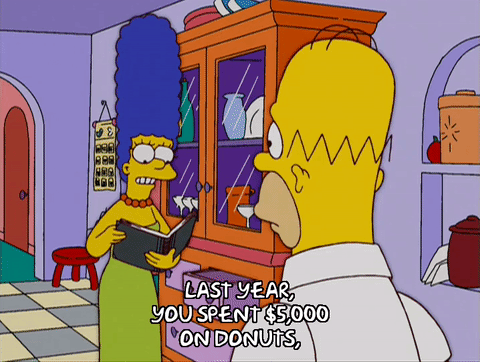
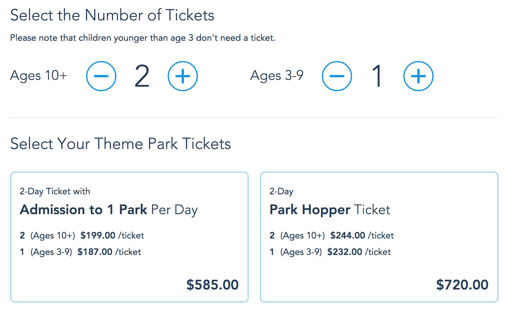

# Budget Buddy

## The Goal

Today we're going to write a program that can help make sure you don't ever accidentally spend too much money at the grocery store by writing a budget app.

A budget is a breakdown of where you plan to spend your money before you actually spend it - it can be easy to spend money on fun things the day you get your paycheck, because it feels like you have all this extra money!



However, it's important to remember to keep money aside for important purchases like groceries, or to save it up for something that matters to you.

If you want more context on what budgeting is and why people do it before starting the lab, you can learn more <a href="http://kwhs.wharton.upenn.edu/2015/02/zina-kumoks-top-5-budget-tips/">here</a>.

## Our Program

We're going to create several different budget checkers. Each one will let a user enter their total before they swipe their card or hand over cash at the register, just to make sure they're not about to overspend.

Some users will want it super simple, so we will write a simple budget checker for them. It will only give them a message if they're about to spend too much money.

Other users will want to know how much money they have left to spend, or how far over budget they are. That's a more complex tool, so we will build it after we've got the simple one done.

We'll start with a budget of 100 dollars, meaning we can spend that much according to our plan. Anything over 100 dollars is considered overspending.

## Defining and Testing

This lab is broken into two parts. The definitions of all our budgets will be in a file called budget.py. We're only DEFINING budgets checkers here, not testing them yet.

We will TEST our budget checkers using the budgetTest.py file. We can run those tests with the command `python budgetTest.py` in our console / terminal / command line.

If you feel ready to jump into the lab, then go for it! If you'd like a little refresher or if you get stuck, read on through the main concepts the lab will cover.

## Useful Skills & Vocab

### Defining versus calling functions

Implementing functions in a program is a two-step process. Functions must first be defined and then they can be called.

###### Defining

```python
def my_test_function():
  return "Hello! Your test has run successfully!"
```

###### Calling

```python
print(my_test_function)
```

If a function is never called, then your program COULD use it, but it never knows when to do so.

### Returning versus printing output

We're relying on returning output when we define our functions, but we're using print statements in our tests so that those return values are visible. Remember, printed data can be seen, returned data can stored in variables or otherwise used.

For a refresher course on the difference, jump back to the <a href="https://github.com/upperlinecode/string-theory-python-methods">String Music Theory lab</a> and read over the notes on printing vs. returning.

### Using multiple arguments

One of the more advanced budget checkers will take two arguments. For example, if you wanted to know how much it costs to buy a family tickets to Disneyland, you'd need TWO pieces of information.

Take a look at this screenshot from Disney's website:



You need to know how many adults (considered 10 years old or older) and how many children (ages 3-9) will be attending. SO let's write out the definition of that function.

```python
def cost_of_disney(adults, children):
  adult_price = adults * 199
  child_price = children * 187
  total_cost = adult_price + child_price
  return total_cost
```

Now that we can calculate the cost of tickets, let's do that for this family:


Let's assume the two smaller children are both between the ages of 3 and 9, so then this family has 6 adults and 2 children.

Find the total cost by calling (and printing!) the function.

```python
print(cost_of_disney(6, 2))
```

### Scope

Fascinatingly, entering a function definition is kind of like entering a pocket dimension - information from within the function doesn't exist outside the function. Here's an example of BAD CODE - code that will fail as a result of improper scoping.

###### Variable scoped inside a function

```python
def set_greeting():
  greeting = "Welcome to the program"

set_greeting() # call the function to assign the string to the variable called greeting.

print(greeting) # Since the variable called greeting was only ever defined inside the function, it's not accessible here. 
```

#### Solutions for scope

Luckily, there's an easy way to get around this. The problem is that the computer assumes any variable defined inside the function should be a local variable (inaccessible from outside the function), so we can just tell it to make the variable global (accessible from anywhere in the program) instead.

###### Make the variable global

```python
def set_greeting():
  global greeting
  greeting = "Welcome to the program"

set_greeting() # call the function to assign the string to the variable called greeting.

print(greeting) # Since we insisted the greeting variable be global instead of defaulting to local, it's now accesible from outside the function!
```

In python, we write `global variableName` at the top of a function to designate it as a global variable. Note that if we have multiple functions in our program, we have to do this at the top of every one of them.
